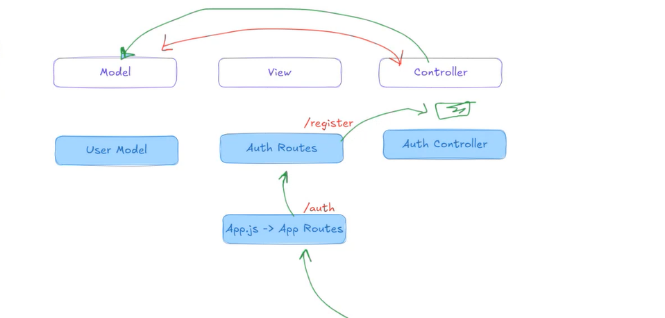

# studentManager React Application
async functions to avoid overlap
if functions related to one model(container)
request (reading ? source ?) (validate ? shape ?)-------------------------(db)
 options (valid to connect (get-post? from browser)) Input Validation-Data Type Validation-Range Validation

200 ok
201 created (post -put)
-----------
client side eror
400 validation  eror 
401 authenticated ? admin ..user?
403 forbidden
404 not found
405 methot not allowed (delete xx)
---------------
request ..... body |params.id :id |query ?x=5&&y=6 (to convert string into number + or Number())

